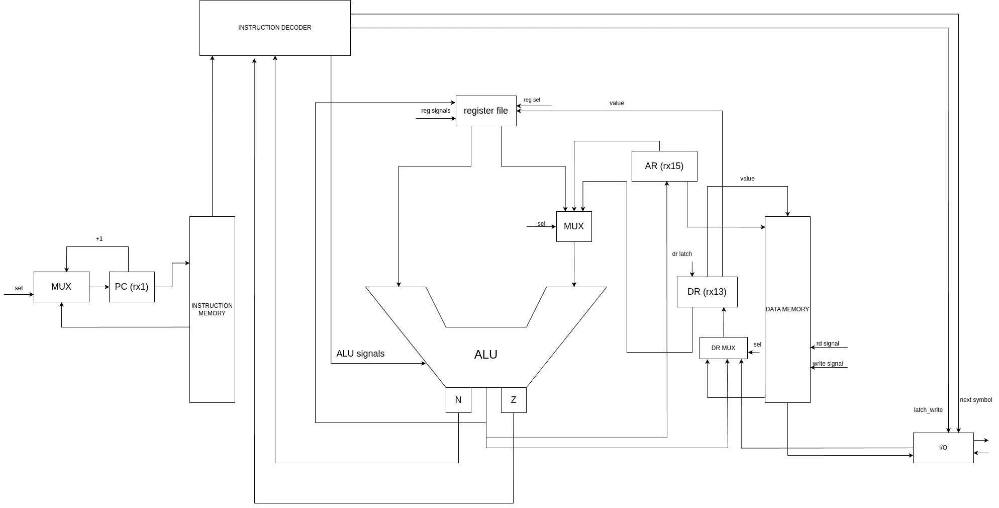

# CSA lab 3

Выполнил Лысенко Артём Константинович P33312

- `alg | risc | harv | hw | instr | struct | stream | port | cstr | prob5 | pipeline`
- Без усложнения

## Язык программирования

Разработанный язык похож на супер упрощенный JS.
Строки разделяются точкой с запятой.

### Язык поддерживает

1. объявление и инициализацию переменных
2. математические операции
3. конструкции `if`, `if-else`, `while`
4. `read()` - читает строку из входного буфера
5. `read_char()` - читает символ,
6. `print_string()`, `print_int()`, `print_char()`

Язык не поддерживает функции, приведенные выше read() и похожее - это просто синтаксис.
Есть только 2 типа - int, str. Типизация сильная, динамическая.
Язык поддерживает области видимости, которые определяются блоками while и if.

### Расширенная форма Бэкуса-Наура

``` ebnf
program ::= statement | program statement
statement ::= conditional | while | io | allocation | assign | if
assign ::= name "=" expr
io ::= read | print_int | print_str
conditional ::= if | else
if ::= "if" "(" comp_expr ")" "{" program "}"
else ::= "else" "{" program "}"
while ::= "while" "(" comp_expr ")" "{" program "}"
allocation ::= "let" name "=" value semicolon 
    | "let" name "=" read_char semicolon 
    | "let" name "=" read semicolon 
read ::= "read()" semicolon
read_char ::= "read_char()" semicolon
print_string ::= "print_str(" name ")" semicolon | "print(" string ")" semicolon
print_int ::= "print_int(" name ")" semicolon | "print(" number ")" semicolon
print_char ::= "print_char(" name ")" semicolon
value ::= string | number
string ::= "\"[\w\s,.:;!?()\\-]+\""
comp_expr ::= expr comparison_sign expr
expr ::= "(" expr ")" | expr op expr | number | string | name
comparison_sign ::= "==" | ">=" | ">" | "<" | "<=" | "!="
name ::= "[a-zA-Z]+"
number ::= "-?[0-9]+"
semicolon ::= ";"
op ::= "*" | "/" | "%" | "+" | "-" | "<<" | ">>" | "&" | "|" | "^"
```

Примеры кода:

```
let f1 = 1;
let f2 = 2;
let ans = f2;
let max = 4000000;
while( f1 + f2 < max ) {
  let f3 = f1 + f2;
  if (f3 % 2 == 0) {
    ans = ans + f3;
  }
  f1 = f2;
  f2 = f3;
}
print_int(ans);
```

```
let b = "cat";
let da = "hello\n";
print_string(da);
```

## Организация памяти

Модель памяти процессора:

1. Instruction memory - память для хранения инструкций для выполнения программы. Машинное слово -- 32 бита, реализуется
   списком объектов класса `MachineWord`.
2. Data memory - в начале лежат статические данные (например, строки, которые записаны в переменную), а после уже идут
   данные, которые заполяются динамически (строки с потока ввода).

#### Instruction memory

```
    +-----------------+
    |   INSTRUCTION   |
    +-----------------+
```

#### Data memory

```
    +-----------------+
    |   STATIC_DATA   |
    +-----------------+
    |      DATA       |
    +-----------------+
    |      EMPTY      |
    |      SPACE      |
    +-----------------+
    |      STACK      |
    +-----------------+
```

На этапе трансляции статические данны вставлюятся в память.
Но так как мы не можем во время трансляции знать точных размеров строк, то используются заглушки, которые потом
ресовлятся на память.
Далее полученная статическая память записывается в файлик, а при эмуляции эти статические данные помещаются в
начало `data_memory`.

Все переменные хранятся на стеке. При выходе из блока(while или if) указатель стека сдвигается на значение, которое было
до входа в этот блок.
Для адресации переменных введен способ адресации относительно начала стека
Числовые литералы загружаются непосредственно с помощью операции LD_LIT. Так как операций со строками нет(кроме чтения),
то все строки - это константы, лежащие в статической памяти.
Ссылка на них(переменная) при этом лежит на стеке.

При вычислении используется как стек, так и регистры - стек в основном используется для хранения промежуточных значений(
кроме случая, когда операция всего одна), в регистрах хранятся значения переменных для вычисления.

## Система команд

Особенности процессора:

- Машинное слово -- 32 бита, знаковое.
- Поток управления:
    - инкремент `PC` после каждой инструкции;
    - условные и безусловные переходы.
      У команды может быть до двух аргументов.

### Набор инструкций машинного кода

| Инструкция  | Кол-во тактов | операнды       | Пояснение                                          |
|:------------|---------------|:---------------|:---------------------------------------------------|
| ST          | 5             | 2 (reg, reg)   | Косвенная адресация - в левый по адресу из правого |
| ST_ADDR     | 4             | 2 (reg, int)   | Прямая адресация                                   |
| ST_STACK    | 4             | 2 (reg, int)   | Относительно конца стека                           |
| LD_ADDR     | 3             | 2 (reg, int)   | Прямая адресация                                   |
| LD_LITERAL  | 2             | 2 (reg, int)   | Загрузка литерала                                  |
| LD_STACK    | 4             | 2 (reg, int)   | Относительно конца стека                           |
| LD          | 4             | 2 (reg, int)   | Косвенная адресация                                |
| JMP         | 3             | 1 (addr)       |                                                    |
| DIV         | 3             | 2 (reg, reg)   |                                                    |
| MUL         | 3             | 2 (reg, reg)   |                                                    |
| MOD         | 3             | 1 (reg)        |                                                    |
| SUB         | 4             | 2 (reg, reg)   |                                                    |
| MV          | 3             | 2 (reg, reg)   |                                                    |
| READ        | 2             | 2 (reg, port)  |                                                    |
| PRINT       | 3             | 2 (reg, port)  |                                                    |
| JLE         | 3             | 1 (addr)       |                                                    |
| JL          | 3             | 1 (addr)       |                                                    |
| JGE         | 3             | 1 (addr)       |                                                    |
| JG          | 3             | 1 (addr)       |                                                    |
| JNE         | 3             | 1 (reg)        |                                                    |
| JE          | 3             | 1 (addr)       |                                                    |
| NEG         | 2             | 1 (reg)        |                                                    |
| SHL         | 3             | 2 (reg, reg)   |                                                    |
| SHR         | 3             | 2 (reg, reg)   |                                                    |
| AND         | 3             | 2 (reg, reg)   |                                                    |
| OR          | 3             | 2 (reg, reg)   |                                                    |
| XOR         | 3             | 2 (reg1, reg2) |                                                    |
| CMP         | 4             | 2 (reg1, reg2  |                                                    |
| PUSH        | 4             | 1 (reg)        |                                                    |
| POP         | 5             | 1 (reg)        |                                                    |
| INC         | 3             | 1 (reg)        |                                                    |
| DEC         | 3             | 1 (reg)        |                                                    |
| ADD_LITERAL | 2             | 2 (reg, val)   |                                                    |
| HALT        | 0             | 0              |                                                    |

Умножение и деление реализованы в АЛУ. Считается, что данное АЛУ такое умеет.
Функции ввода строки и числа реализованы на уровне транслятор путем вставки машинного кода.

### Кодирование инструкций

- Машинный код сериализуется в список JSON.
- Один элемент списка -- одна инструкция.
- Индекс списка -- адрес инструкции. Используется для команд перехода.

Пример:

```json
[
  {
    "index": 25,
    "opcode": "ADD",
    "arg1": "r9",
    "arg2": "r10"
  }
]
```

где:

- `opcode` -- строка с кодом операции
- `arg1`, `arg2` -- аргументы
- `index` - адрес

Типы данных в модуле [machine](./lab3/machine/isa.py), где:

- `Opcode` -- перечисление кодов операций;

## Транслятор

Интерфейс командной строки: `translator.py <input_file> <target_file> <save_static_mem_to>`

Реализовано в модуле: [translator](./lab3/interpreter/translator.py)

Этапы трансляции (функция `translate`):

1. Лексер - Трансформирование текста в последовательность значимых термов.
2. Парсер - перевод представления из первого этапа в АСТ.
3. Трансляция АСТ в машинный код.

Правила генерации машинного кода:

Каждая нода дерева АСТ переводится в соответсвтющее представление в ассемблерном коде. Для каждого типа ноды написан
обработчик,
в котором эта нода транслируется в машинный код. Основная часть функционала языка - конструкции вывода и ввода,
циклы и ветвления - реализованы в user-space на уровне трансляции в машинный код. Умножение и деление, как упоминалось
выше, умеет делать АЛУ.

## Модель процессора

Интерфейс командной строки: `machine.py <machine_code_file> <input_file> <read_static_data_from>`

Реализовано в модуле: [machine](./lab3/machine/virtual_machine.py)



Модель процессора имеет 16 регистров:

```
rx0 - хардкод 0

rx1 (program counter) - адрес следующей инструкции

rx2 - ptr for dynamic mem 

rx3 - rx8 - регистры общего назначения

rx9 - rx12 - временные регистры 

rx13 - data register

rx14 - stack pointer

rx15 - временной регистр
```

Ввод и вывод имеет порты

Сигналы и селекторы - oe (read signal), wr (write signal) - чтение, запись из памяти

ALU signals - выбор операции алу

latch_reg_NUM - защелкнуть регистр

reg sel - выбрать регистр из регистрового файла

latch_write - вывести в устройство

next_symbol - ввести с устройства

- Цикл симуляции осуществляется в функции `simulation`.
- Шаг моделирования соответствует одной инструкции с выводом состояния в журнал.
- Для журнала состояний процессора используется стандартный модуль `logging`.
- Количество инструкций для моделирования лимитировано.

## Тестирование

Приведы следующие тесты:

1. [cat](./tests/golden/cat.yml) -- программа `cat`, повтор ввода пользователя.
2. [hello_user](./tests/golden/hello_user.yml) -- приветствие пользователя по введенному имени.
3. [math](./tests/golden/math.yml) -- тест корректности выполнения математических операций.
4. [print_string](./tests/golden/print_string.yml) -- вывод строки из перменной.
5. [prob5](./tests/golden/prob5.yml) -- prob5 алгоритм.

Рассмотрим алгоритм вывода строки. Исходный код приведен ниже

```
let b = "cat";
let da = "hello\n";
print_string(da);
```

После трансляции

```json
[{"index": 0, "opcode": "LD_LITERAL", "arg1": "r4", "arg2": 0},
   {"index": 1, "opcode": "PUSH", "arg1": "r4", "arg2": 0},
   {"index": 2, "opcode": "LD_LITERAL", "arg1": "r5", "arg2": 0},
   {"index": 3, "opcode": "ST_STACK", "arg1": "r5", "arg2": 0},
   {"index": 4, "opcode": "LD_LITERAL", "arg1": "r6", "arg2": 0},
   {"index": 5, "opcode": "PUSH", "arg1": "r6", "arg2": 0},
   {"index": 6, "opcode": "LD_LITERAL", "arg1": "r7", "arg2": 4},
   {"index": 7, "opcode": "ST_STACK", "arg1": "r7", "arg2": 1},
   {"index": 8, "opcode": "LD_STACK", "arg1": "r9", "arg2": 1},
   {"index": 9, "opcode": "MV", "arg1": "r9", "arg2": "r11"},
   {"index": 10, "opcode": "LD", "arg1": "r9", "arg2": "r9"},
   {"index": 11, "opcode": "CMP", "arg1": "r9", "arg2": "r0"},
   {"index": 12, "opcode": "JE", "arg1": 17, "arg2": 0},
   {"index": 13, "opcode": "PRINT", "arg1": "r9", "arg2": 0},
   {"index": 14, "opcode": "INC", "arg1": "r11", "arg2": 0},
   {"index": 15, "opcode": "LD", "arg1": "r9", "arg2": "r11"},
   {"index": 16, "opcode": "JMP", "arg1": 11, "arg2": 0},
   {"index": 17, "opcode": "HALT", "arg1": 0, "arg2": 0}]
```

Журнал выглядит следующим образом:

```
DEBUG virtual_machine:simulation TICK:   0 PC:   0  MEM_OUT: r4 0 reg: 'r0': 0, 'r1': 0, 'r2': 0, 'r3': 0, 'r4': 0, 'r5': 0, 'r6': 0, 'r7': 0, 'r8': 0, 'r9': 0, 'r10': 0, 'r11': 0, 'r12': 0, 'r13': 0, 'r14': 2047, 'r15': 0, 'r16': 11 	  ('0'@Opcode.LD_LITERAL:Register.r4 0)
DEBUG virtual_machine:simulation TICK:   3 PC:   1  MEM_OUT: r4 0 reg: 'r0': 0, 'r1': 1, 'r2': 0, 'r3': 0, 'r4': 0, 'r5': 0, 'r6': 0, 'r7': 0, 'r8': 0, 'r9': 0, 'r10': 0, 'r11': 0, 'r12': 0, 'r13': Register.r4, 'r14': 2047, 'r15': 0, 'r16': 11 	  ('1'@Opcode.PUSH:Register.r4 0)
DEBUG virtual_machine:simulation TICK:   8 PC:   2  MEM_OUT: r5 0 reg: 'r0': 0, 'r1': 2, 'r2': 0, 'r3': 0, 'r4': 0, 'r5': 0, 'r6': 0, 'r7': 0, 'r8': 0, 'r9': 0, 'r10': 0, 'r11': 0, 'r12': 0, 'r13': 0, 'r14': 2046, 'r15': 0, 'r16': 11 	  ('2'@Opcode.LD_LITERAL:Register.r5 0)
DEBUG virtual_machine:simulation TICK:  11 PC:   3  MEM_OUT: r5 0 reg: 'r0': 0, 'r1': 3, 'r2': 0, 'r3': 0, 'r4': 0, 'r5': 0, 'r6': 0, 'r7': 0, 'r8': 0, 'r9': 0, 'r10': 0, 'r11': 0, 'r12': 0, 'r13': Register.r5, 'r14': 2046, 'r15': 0, 'r16': 11 	  ('3'@Opcode.ST_STACK:Register.r5 0)
DEBUG virtual_machine:simulation TICK:  16 PC:   4  MEM_OUT: r6 0 reg: 'r0': 0, 'r1': 4, 'r2': 0, 'r3': 0, 'r4': 0, 'r5': 0, 'r6': 0, 'r7': 0, 'r8': 0, 'r9': 0, 'r10': 0, 'r11': 0, 'r12': 0, 'r13': 0, 'r14': 2046, 'r15': 0, 'r16': 11 	  ('4'@Opcode.LD_LITERAL:Register.r6 0)
DEBUG virtual_machine:simulation TICK:  19 PC:   5  MEM_OUT: r6 0 reg: 'r0': 0, 'r1': 5, 'r2': 0, 'r3': 0, 'r4': 0, 'r5': 0, 'r6': 0, 'r7': 0, 'r8': 0, 'r9': 0, 'r10': 0, 'r11': 0, 'r12': 0, 'r13': Register.r6, 'r14': 2046, 'r15': 0, 'r16': 11 	  ('5'@Opcode.PUSH:Register.r6 0)
DEBUG virtual_machine:simulation TICK:  24 PC:   6  MEM_OUT: r7 4 reg: 'r0': 0, 'r1': 6, 'r2': 0, 'r3': 0, 'r4': 0, 'r5': 0, 'r6': 0, 'r7': 0, 'r8': 0, 'r9': 0, 'r10': 0, 'r11': 0, 'r12': 0, 'r13': 0, 'r14': 2045, 'r15': 0, 'r16': 11 	  ('6'@Opcode.LD_LITERAL:Register.r7 4)
DEBUG virtual_machine:simulation TICK:  27 PC:   7  MEM_OUT: r7 1 reg: 'r0': 0, 'r1': 7, 'r2': 0, 'r3': 0, 'r4': 0, 'r5': 0, 'r6': 0, 'r7': 4, 'r8': 0, 'r9': 0, 'r10': 0, 'r11': 0, 'r12': 0, 'r13': Register.r7, 'r14': 2045, 'r15': 0, 'r16': 11 	  ('7'@Opcode.ST_STACK:Register.r7 1)
DEBUG virtual_machine:simulation TICK:  32 PC:   8  MEM_OUT: r9 1 reg: 'r0': 0, 'r1': 8, 'r2': 0, 'r3': 0, 'r4': 0, 'r5': 0, 'r6': 0, 'r7': 4, 'r8': 0, 'r9': 0, 'r10': 0, 'r11': 0, 'r12': 0, 'r13': 4, 'r14': 2045, 'r15': 0, 'r16': 11 	  ('8'@Opcode.LD_STACK:Register.r9 1)
DEBUG virtual_machine:simulation TICK:  37 PC:   9  MEM_OUT: r9 r11 reg: 'r0': 0, 'r1': 9, 'r2': 0, 'r3': 0, 'r4': 0, 'r5': 0, 'r6': 0, 'r7': 4, 'r8': 0, 'r9': 4, 'r10': 0, 'r11': 0, 'r12': 0, 'r13': 4, 'r14': 2045, 'r15': 0, 'r16': 11 	  ('9'@Opcode.MV:Register.r9 Register.r11)
DEBUG virtual_machine:simulation TICK:  41 PC:  10  MEM_OUT: r9 r9 reg: 'r0': 0, 'r1': 10, 'r2': 0, 'r3': 0, 'r4': 0, 'r5': 0, 'r6': 0, 'r7': 4, 'r8': 0, 'r9': 4, 'r10': 0, 'r11': 4, 'r12': 0, 'r13': Register.r9, 'r14': 2045, 'r15': 0, 'r16': 11 	  ('10'@Opcode.LD:Register.r9 Register.r9)
DEBUG virtual_machine:simulation TICK:  46 PC:  11  MEM_OUT: r9 r0 reg: 'r0': 0, 'r1': 11, 'r2': 0, 'r3': 0, 'r4': 0, 'r5': 0, 'r6': 0, 'r7': 4, 'r8': 0, 'r9': 104, 'r10': 0, 'r11': 4, 'r12': 0, 'r13': 104, 'r14': 2045, 'r15': 0, 'r16': 11 	  ('11'@Opcode.CMP:Register.r9 Register.r0)
DEBUG virtual_machine:simulation TICK:  51 PC:  12  MEM_OUT: 17 0 reg: 'r0': 0, 'r1': 12, 'r2': 0, 'r3': 0, 'r4': 0, 'r5': 0, 'r6': 0, 'r7': 4, 'r8': 0, 'r9': 104, 'r10': 0, 'r11': 4, 'r12': 0, 'r13': Register.r9, 'r14': 2045, 'r15': 0, 'r16': 11 	  ('12'@Opcode.JE:17 0)
DEBUG virtual_machine:simulation TICK:  53 PC:  13  MEM_OUT: r9 0 reg: 'r0': 0, 'r1': 13, 'r2': 0, 'r3': 0, 'r4': 0, 'r5': 0, 'r6': 0, 'r7': 4, 'r8': 0, 'r9': 104, 'r10': 0, 'r11': 4, 'r12': 0, 'r13': 17, 'r14': 2045, 'r15': 0, 'r16': 11 	  ('13'@Opcode.PRINT:Register.r9 0)
DEBUG virtual_machine:simulation TICK:  57 PC:  14  MEM_OUT: r11 0 reg: 'r0': 0, 'r1': 14, 'r2': 0, 'r3': 0, 'r4': 0, 'r5': 0, 'r6': 0, 'r7': 4, 'r8': 0, 'r9': 104, 'r10': 0, 'r11': 4, 'r12': 0, 'r13': Register.r9, 'r14': 2045, 'r15': 0, 'r16': 11 	  ('14'@Opcode.INC:Register.r11 0)
DEBUG virtual_machine:simulation TICK:  60 PC:  15  MEM_OUT: r9 r11 reg: 'r0': 0, 'r1': 15, 'r2': 0, 'r3': 0, 'r4': 0, 'r5': 0, 'r6': 0, 'r7': 4, 'r8': 0, 'r9': 104, 'r10': 0, 'r11': 5, 'r12': 0, 'r13': Register.r11, 'r14': 2045, 'r15': 0, 'r16': 11 	  ('15'@Opcode.LD:Register.r9 Register.r11)
DEBUG virtual_machine:simulation TICK:  65 PC:  16  MEM_OUT: 11 0 reg: 'r0': 0, 'r1': 16, 'r2': 0, 'r3': 0, 'r4': 0, 'r5': 0, 'r6': 0, 'r7': 4, 'r8': 0, 'r9': 101, 'r10': 0, 'r11': 5, 'r12': 0, 'r13': 101, 'r14': 2045, 'r15': 0, 'r16': 11 	  ('16'@Opcode.JMP:11 0)
DEBUG virtual_machine:simulation TICK:  67 PC:  11  MEM_OUT: r9 r0 reg: 'r0': 0, 'r1': 11, 'r2': 0, 'r3': 0, 'r4': 0, 'r5': 0, 'r6': 0, 'r7': 4, 'r8': 0, 'r9': 101, 'r10': 0, 'r11': 5, 'r12': 0, 'r13': 11, 'r14': 2045, 'r15': 0, 'r16': 11 	  ('11'@Opcode.CMP:Register.r9 Register.r0)
DEBUG virtual_machine:simulation TICK:  72 PC:  12  MEM_OUT: 17 0 reg: 'r0': 0, 'r1': 12, 'r2': 0, 'r3': 0, 'r4': 0, 'r5': 0, 'r6': 0, 'r7': 4, 'r8': 0, 'r9': 101, 'r10': 0, 'r11': 5, 'r12': 0, 'r13': Register.r9, 'r14': 2045, 'r15': 0, 'r16': 11 	  ('12'@Opcode.JE:17 0)
DEBUG virtual_machine:simulation TICK:  74 PC:  13  MEM_OUT: r9 0 reg: 'r0': 0, 'r1': 13, 'r2': 0, 'r3': 0, 'r4': 0, 'r5': 0, 'r6': 0, 'r7': 4, 'r8': 0, 'r9': 101, 'r10': 0, 'r11': 5, 'r12': 0, 'r13': 17, 'r14': 2045, 'r15': 0, 'r16': 11 	  ('13'@Opcode.PRINT:Register.r9 0)
DEBUG virtual_machine:simulation TICK:  78 PC:  14  MEM_OUT: r11 0 reg: 'r0': 0, 'r1': 14, 'r2': 0, 'r3': 0, 'r4': 0, 'r5': 0, 'r6': 0, 'r7': 4, 'r8': 0, 'r9': 101, 'r10': 0, 'r11': 5, 'r12': 0, 'r13': Register.r9, 'r14': 2045, 'r15': 0, 'r16': 11 	  ('14'@Opcode.INC:Register.r11 0)
DEBUG virtual_machine:simulation TICK:  81 PC:  15  MEM_OUT: r9 r11 reg: 'r0': 0, 'r1': 15, 'r2': 0, 'r3': 0, 'r4': 0, 'r5': 0, 'r6': 0, 'r7': 4, 'r8': 0, 'r9': 101, 'r10': 0, 'r11': 6, 'r12': 0, 'r13': Register.r11, 'r14': 2045, 'r15': 0, 'r16': 11 	  ('15'@Opcode.LD:Register.r9 Register.r11)
DEBUG virtual_machine:simulation TICK:  86 PC:  16  MEM_OUT: 11 0 reg: 'r0': 0, 'r1': 16, 'r2': 0, 'r3': 0, 'r4': 0, 'r5': 0, 'r6': 0, 'r7': 4, 'r8': 0, 'r9': 108, 'r10': 0, 'r11': 6, 'r12': 0, 'r13': 108, 'r14': 2045, 'r15': 0, 'r16': 11 	  ('16'@Opcode.JMP:11 0)
DEBUG virtual_machine:simulation TICK:  88 PC:  11  MEM_OUT: r9 r0 reg: 'r0': 0, 'r1': 11, 'r2': 0, 'r3': 0, 'r4': 0, 'r5': 0, 'r6': 0, 'r7': 4, 'r8': 0, 'r9': 108, 'r10': 0, 'r11': 6, 'r12': 0, 'r13': 11, 'r14': 2045, 'r15': 0, 'r16': 11 	  ('11'@Opcode.CMP:Register.r9 Register.r0)
DEBUG virtual_machine:simulation TICK:  93 PC:  12  MEM_OUT: 17 0 reg: 'r0': 0, 'r1': 12, 'r2': 0, 'r3': 0, 'r4': 0, 'r5': 0, 'r6': 0, 'r7': 4, 'r8': 0, 'r9': 108, 'r10': 0, 'r11': 6, 'r12': 0, 'r13': Register.r9, 'r14': 2045, 'r15': 0, 'r16': 11 	  ('12'@Opcode.JE:17 0)
DEBUG virtual_machine:simulation TICK:  95 PC:  13  MEM_OUT: r9 0 reg: 'r0': 0, 'r1': 13, 'r2': 0, 'r3': 0, 'r4': 0, 'r5': 0, 'r6': 0, 'r7': 4, 'r8': 0, 'r9': 108, 'r10': 0, 'r11': 6, 'r12': 0, 'r13': 17, 'r14': 2045, 'r15': 0, 'r16': 11 	  ('13'@Opcode.PRINT:Register.r9 0)
DEBUG virtual_machine:simulation TICK:  99 PC:  14  MEM_OUT: r11 0 reg: 'r0': 0, 'r1': 14, 'r2': 0, 'r3': 0, 'r4': 0, 'r5': 0, 'r6': 0, 'r7': 4, 'r8': 0, 'r9': 108, 'r10': 0, 'r11': 6, 'r12': 0, 'r13': Register.r9, 'r14': 2045, 'r15': 0, 'r16': 11 	  ('14'@Opcode.INC:Register.r11 0)
DEBUG virtual_machine:simulation TICK: 102 PC:  15  MEM_OUT: r9 r11 reg: 'r0': 0, 'r1': 15, 'r2': 0, 'r3': 0, 'r4': 0, 'r5': 0, 'r6': 0, 'r7': 4, 'r8': 0, 'r9': 108, 'r10': 0, 'r11': 7, 'r12': 0, 'r13': Register.r11, 'r14': 2045, 'r15': 0, 'r16': 11 	  ('15'@Opcode.LD:Register.r9 Register.r11)
DEBUG virtual_machine:simulation TICK: 107 PC:  16  MEM_OUT: 11 0 reg: 'r0': 0, 'r1': 16, 'r2': 0, 'r3': 0, 'r4': 0, 'r5': 0, 'r6': 0, 'r7': 4, 'r8': 0, 'r9': 108, 'r10': 0, 'r11': 7, 'r12': 0, 'r13': 108, 'r14': 2045, 'r15': 0, 'r16': 11 	  ('16'@Opcode.JMP:11 0)
DEBUG virtual_machine:simulation TICK: 109 PC:  11  MEM_OUT: r9 r0 reg: 'r0': 0, 'r1': 11, 'r2': 0, 'r3': 0, 'r4': 0, 'r5': 0, 'r6': 0, 'r7': 4, 'r8': 0, 'r9': 108, 'r10': 0, 'r11': 7, 'r12': 0, 'r13': 11, 'r14': 2045, 'r15': 0, 'r16': 11 	  ('11'@Opcode.CMP:Register.r9 Register.r0)
DEBUG virtual_machine:simulation TICK: 114 PC:  12  MEM_OUT: 17 0 reg: 'r0': 0, 'r1': 12, 'r2': 0, 'r3': 0, 'r4': 0, 'r5': 0, 'r6': 0, 'r7': 4, 'r8': 0, 'r9': 108, 'r10': 0, 'r11': 7, 'r12': 0, 'r13': Register.r9, 'r14': 2045, 'r15': 0, 'r16': 11 	  ('12'@Opcode.JE:17 0)
DEBUG virtual_machine:simulation TICK: 116 PC:  13  MEM_OUT: r9 0 reg: 'r0': 0, 'r1': 13, 'r2': 0, 'r3': 0, 'r4': 0, 'r5': 0, 'r6': 0, 'r7': 4, 'r8': 0, 'r9': 108, 'r10': 0, 'r11': 7, 'r12': 0, 'r13': 17, 'r14': 2045, 'r15': 0, 'r16': 11 	  ('13'@Opcode.PRINT:Register.r9 0)
DEBUG virtual_machine:simulation TICK: 120 PC:  14  MEM_OUT: r11 0 reg: 'r0': 0, 'r1': 14, 'r2': 0, 'r3': 0, 'r4': 0, 'r5': 0, 'r6': 0, 'r7': 4, 'r8': 0, 'r9': 108, 'r10': 0, 'r11': 7, 'r12': 0, 'r13': Register.r9, 'r14': 2045, 'r15': 0, 'r16': 11 	  ('14'@Opcode.INC:Register.r11 0)
DEBUG virtual_machine:simulation TICK: 123 PC:  15  MEM_OUT: r9 r11 reg: 'r0': 0, 'r1': 15, 'r2': 0, 'r3': 0, 'r4': 0, 'r5': 0, 'r6': 0, 'r7': 4, 'r8': 0, 'r9': 108, 'r10': 0, 'r11': 8, 'r12': 0, 'r13': Register.r11, 'r14': 2045, 'r15': 0, 'r16': 11 	  ('15'@Opcode.LD:Register.r9 Register.r11)
DEBUG virtual_machine:simulation TICK: 128 PC:  16  MEM_OUT: 11 0 reg: 'r0': 0, 'r1': 16, 'r2': 0, 'r3': 0, 'r4': 0, 'r5': 0, 'r6': 0, 'r7': 4, 'r8': 0, 'r9': 111, 'r10': 0, 'r11': 8, 'r12': 0, 'r13': 111, 'r14': 2045, 'r15': 0, 'r16': 11 	  ('16'@Opcode.JMP:11 0)
DEBUG virtual_machine:simulation TICK: 130 PC:  11  MEM_OUT: r9 r0 reg: 'r0': 0, 'r1': 11, 'r2': 0, 'r3': 0, 'r4': 0, 'r5': 0, 'r6': 0, 'r7': 4, 'r8': 0, 'r9': 111, 'r10': 0, 'r11': 8, 'r12': 0, 'r13': 11, 'r14': 2045, 'r15': 0, 'r16': 11 	  ('11'@Opcode.CMP:Register.r9 Register.r0)
DEBUG virtual_machine:simulation TICK: 135 PC:  12  MEM_OUT: 17 0 reg: 'r0': 0, 'r1': 12, 'r2': 0, 'r3': 0, 'r4': 0, 'r5': 0, 'r6': 0, 'r7': 4, 'r8': 0, 'r9': 111, 'r10': 0, 'r11': 8, 'r12': 0, 'r13': Register.r9, 'r14': 2045, 'r15': 0, 'r16': 11 	  ('12'@Opcode.JE:17 0)
DEBUG virtual_machine:simulation TICK: 137 PC:  13  MEM_OUT: r9 0 reg: 'r0': 0, 'r1': 13, 'r2': 0, 'r3': 0, 'r4': 0, 'r5': 0, 'r6': 0, 'r7': 4, 'r8': 0, 'r9': 111, 'r10': 0, 'r11': 8, 'r12': 0, 'r13': 17, 'r14': 2045, 'r15': 0, 'r16': 11 	  ('13'@Opcode.PRINT:Register.r9 0)
DEBUG virtual_machine:simulation TICK: 141 PC:  14  MEM_OUT: r11 0 reg: 'r0': 0, 'r1': 14, 'r2': 0, 'r3': 0, 'r4': 0, 'r5': 0, 'r6': 0, 'r7': 4, 'r8': 0, 'r9': 111, 'r10': 0, 'r11': 8, 'r12': 0, 'r13': Register.r9, 'r14': 2045, 'r15': 0, 'r16': 11 	  ('14'@Opcode.INC:Register.r11 0)
DEBUG virtual_machine:simulation TICK: 144 PC:  15  MEM_OUT: r9 r11 reg: 'r0': 0, 'r1': 15, 'r2': 0, 'r3': 0, 'r4': 0, 'r5': 0, 'r6': 0, 'r7': 4, 'r8': 0, 'r9': 111, 'r10': 0, 'r11': 9, 'r12': 0, 'r13': Register.r11, 'r14': 2045, 'r15': 0, 'r16': 11 	  ('15'@Opcode.LD:Register.r9 Register.r11)
DEBUG virtual_machine:simulation TICK: 149 PC:  16  MEM_OUT: 11 0 reg: 'r0': 0, 'r1': 16, 'r2': 0, 'r3': 0, 'r4': 0, 'r5': 0, 'r6': 0, 'r7': 4, 'r8': 0, 'r9': 10, 'r10': 0, 'r11': 9, 'r12': 0, 'r13': 10, 'r14': 2045, 'r15': 0, 'r16': 11 	  ('16'@Opcode.JMP:11 0)
DEBUG virtual_machine:simulation TICK: 151 PC:  11  MEM_OUT: r9 r0 reg: 'r0': 0, 'r1': 11, 'r2': 0, 'r3': 0, 'r4': 0, 'r5': 0, 'r6': 0, 'r7': 4, 'r8': 0, 'r9': 10, 'r10': 0, 'r11': 9, 'r12': 0, 'r13': 11, 'r14': 2045, 'r15': 0, 'r16': 11 	  ('11'@Opcode.CMP:Register.r9 Register.r0)
DEBUG virtual_machine:simulation TICK: 156 PC:  12  MEM_OUT: 17 0 reg: 'r0': 0, 'r1': 12, 'r2': 0, 'r3': 0, 'r4': 0, 'r5': 0, 'r6': 0, 'r7': 4, 'r8': 0, 'r9': 10, 'r10': 0, 'r11': 9, 'r12': 0, 'r13': Register.r9, 'r14': 2045, 'r15': 0, 'r16': 11 	  ('12'@Opcode.JE:17 0)
DEBUG virtual_machine:simulation TICK: 158 PC:  13  MEM_OUT: r9 0 reg: 'r0': 0, 'r1': 13, 'r2': 0, 'r3': 0, 'r4': 0, 'r5': 0, 'r6': 0, 'r7': 4, 'r8': 0, 'r9': 10, 'r10': 0, 'r11': 9, 'r12': 0, 'r13': 17, 'r14': 2045, 'r15': 0, 'r16': 11 	  ('13'@Opcode.PRINT:Register.r9 0)
DEBUG virtual_machine:simulation TICK: 162 PC:  14  MEM_OUT: r11 0 reg: 'r0': 0, 'r1': 14, 'r2': 0, 'r3': 0, 'r4': 0, 'r5': 0, 'r6': 0, 'r7': 4, 'r8': 0, 'r9': 10, 'r10': 0, 'r11': 9, 'r12': 0, 'r13': Register.r9, 'r14': 2045, 'r15': 0, 'r16': 11 	  ('14'@Opcode.INC:Register.r11 0)
DEBUG virtual_machine:simulation TICK: 165 PC:  15  MEM_OUT: r9 r11 reg: 'r0': 0, 'r1': 15, 'r2': 0, 'r3': 0, 'r4': 0, 'r5': 0, 'r6': 0, 'r7': 4, 'r8': 0, 'r9': 10, 'r10': 0, 'r11': 10, 'r12': 0, 'r13': Register.r11, 'r14': 2045, 'r15': 0, 'r16': 11 	  ('15'@Opcode.LD:Register.r9 Register.r11)
DEBUG virtual_machine:simulation TICK: 170 PC:  16  MEM_OUT: 11 0 reg: 'r0': 0, 'r1': 16, 'r2': 0, 'r3': 0, 'r4': 0, 'r5': 0, 'r6': 0, 'r7': 4, 'r8': 0, 'r9': 0, 'r10': 0, 'r11': 10, 'r12': 0, 'r13': 0, 'r14': 2045, 'r15': 0, 'r16': 11 	  ('16'@Opcode.JMP:11 0)
DEBUG virtual_machine:simulation TICK: 172 PC:  11  MEM_OUT: r9 r0 reg: 'r0': 0, 'r1': 11, 'r2': 0, 'r3': 0, 'r4': 0, 'r5': 0, 'r6': 0, 'r7': 4, 'r8': 0, 'r9': 0, 'r10': 0, 'r11': 10, 'r12': 0, 'r13': 11, 'r14': 2045, 'r15': 0, 'r16': 11 	  ('11'@Opcode.CMP:Register.r9 Register.r0)
DEBUG virtual_machine:simulation TICK: 177 PC:  12  MEM_OUT: 17 0 reg: 'r0': 0, 'r1': 12, 'r2': 0, 'r3': 0, 'r4': 0, 'r5': 0, 'r6': 0, 'r7': 4, 'r8': 0, 'r9': 0, 'r10': 0, 'r11': 10, 'r12': 0, 'r13': Register.r9, 'r14': 2045, 'r15': 0, 'r16': 11 	  ('12'@Opcode.JE:17 0)
DEBUG virtual_machine:simulation TICK: 179 PC:  17  MEM_OUT: 0 0 reg: 'r0': 0, 'r1': 17, 'r2': 0, 'r3': 0, 'r4': 0, 'r5': 0, 'r6': 0, 'r7': 4, 'r8': 0, 'r9': 0, 'r10': 0, 'r11': 10, 'r12': 0, 'r13': 17, 'r14': 2045, 'r15': 0, 'r16': 11 	  ('17'@Opcode.HALT:0 0)
INFO virtual_machine:simulation output_buffer: 'hello\n'
```

Интеграционные тесты реализованы здесь [tests](./tests/test_machine.py):

- использованы golden тесты, конфигурация которых лежит в папке [golden](./tests/golden)

### CI

CI проходит на GitHub

```yaml
name: CI

on:
  push:
    branches: [ "main" ]
  pull_request:
    branches: [ "main" ]

permissions:
  contents: read

jobs:
  lint:
    runs-on: ubuntu-latest

    steps:
      - uses: actions/checkout@v4
      - name: Install poetry
        run: pip install poetry
      - name: Set up Python 3.12
        uses: actions/setup-python@v4
        with:
          python-version: "3.12"
          cache: "poetry"
      - name: Install project
        run: |
          poetry install
      - name: Lint with ruff
        run: |
          poetry run python -m ruff lab3
  test:
    runs-on: ubuntu-latest
    steps:
      - uses: actions/checkout@v4
      - name: Install poetry
        run: pip install poetry
      - name: Set up Python 3.12
        uses: actions/setup-python@v4
        with:
          python-version: "3.12"
          cache: "poetry"
      - name: Install project
        run: |
          poetry install
      - name: Run tests
        run: |
          poetry run pytest ./tests -v
    needs: lint
```

- `poetry` -- управления зависимостями для языка программирования Python.
- `pytest` -- утилита для запуска тестов.
- `ruff` -- утилита для форматирования и проверки стиля кодирования.

Пример проверки исходного кода:

```shell
$  poetry run pytest ./tests -v
```

```
================================ test session starts =================================
platform linux -- Python 3.12.1, pytest-7.4.4, pluggy-1.3.0 -- /home/kalin/PycharmProjects/csa-lab-3-last/.venv/bin/python
cachedir: .pytest_cache
rootdir: /home/kalin/PycharmProjects/csa-lab-3-last
configfile: pyproject.toml
plugins: golden-0.2.2
collected 5 items                                                                    

tests/test_machine.py::test_translator_and_machine[golden/cat.yml] PASSED      [ 20%]
tests/test_machine.py::test_translator_and_machine[golden/prob5.yml] PASSED    [ 40%]
tests/test_machine.py::test_translator_and_machine[golden/math.yml] PASSED     [ 60%]
tests/test_machine.py::test_translator_and_machine[golden/print_string.yml] PASSED [ 80%]
tests/test_machine.py::test_translator_and_machine[golden/hello_user.yml] PASSED [100%]

================================= 5 passed in 0.40s ==================================

```

```text
| ФИО                               | алг          | LoC |  code byte  | code instr | instr count | ticks |                                       вариант
| Лысенко Артём Константинович      | cat          | 5   |      -      |    15      |      129    | 491   |  alg | risc | harv | hw | instr | struct | stream | port | cstr | prob5 | pipeline
| Лысенко Артём Константинович      | prob5        | 13  |      -      |    101     |     1717    | 7722  |  alg | risc | harv | hw | instr | struct | stream | port | cstr | prob5 | pipeline
| Лысенко Артём Константинович      | hello_user   | 6   |      -      |    64      |      235    | 842   |  alg | risc | harv | hw | instr | struct | stream | port | cstr | prob5 | pipeline
```